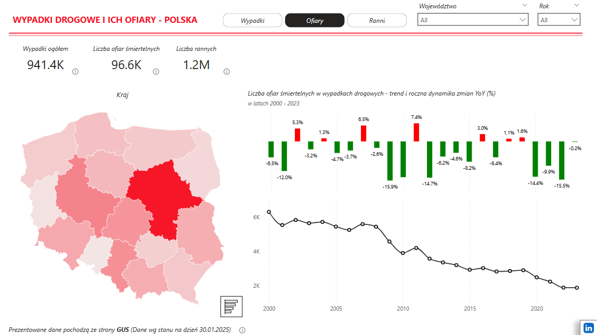
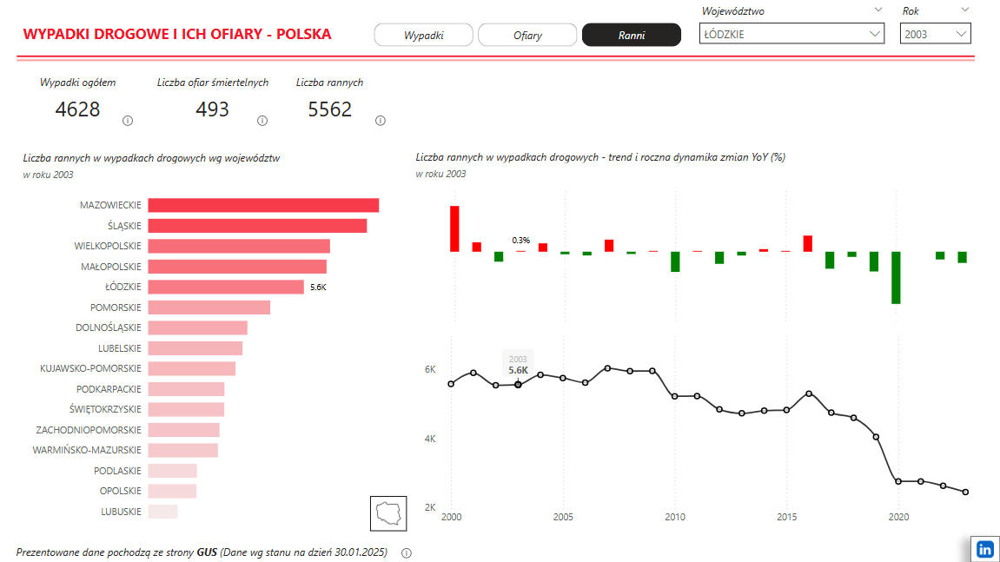

# 🚗 Analiza Wypadków Drogowych i ich ofiar w Polsce (2000-2023)

Raport przedstawia analizę liczby wypadków drogowych w Polsce, w latach 2000-2023 na podstawie danych GUS.
Zawiera interaktywne wizualizacje, trend czasowy oraz wskaźnik zmiany liczby wypadków/ofiar/rannych rok do roku.

## 📂 Struktura :
- 📁 **Dataset** – źródłowe dane CSV z GUS 
- 📁 **wypadki_2000_2023** – plik .pbix  
- 📁 **Screenshots** – podgląd dashboardów  
- 📁 **Documentation** – opis przekształceń danych (ETL) w Power Query 

## 📊 Raport zawiera:

-✅ Liczba wypadków w podziale na województwa (interaktywna mapa Polski + wykres kolumnowy)

-✅ Zmiana rok do roku (wzrost/spadek liczby wypadków)

-✅ Trend roczny (wykres liniowy pokazujący zmiany na przestrzeni lat)

🖼️ **Podgląd raportu:**  

